# 🛒 Análisis de Datos de Plataforma de E-commerce

## 🎯 Objetivo

Analizar el comportamiento de los usuarios en una plataforma de comercio electrónico, evaluando su flujo de navegación, las órdenes de compra y los costos por fuente de adquisición, con el fin de generar métricas clave para la toma de decisiones estratégicas.

---

## 🗂️ Descripción del Proyecto

Este proyecto comprende la inspección, limpieza, transformación y análisis de tres fuentes de datos:

1. **Visitas de usuarios** (`visits_log_us.csv`)  
2. **Órdenes de compra** (`orders_log_us.csv`)  
3. **Costos de adquisición por fuente** (`costs_us.csv`)

Se implementan procesos de:

- Limpieza de datos (fechas, columnas, duplicados).
- Enriquecimiento temporal (día, semana, mes).
- Métricas de negocio: CAC (Costo de Adquisición de Cliente), tasa de conversión, ingresos mensuales.
- Visualizaciones para apoyar las conclusiones.

---

## 📈 Principales Resultados

### 🧑‍💻 Comportamiento de los usuarios

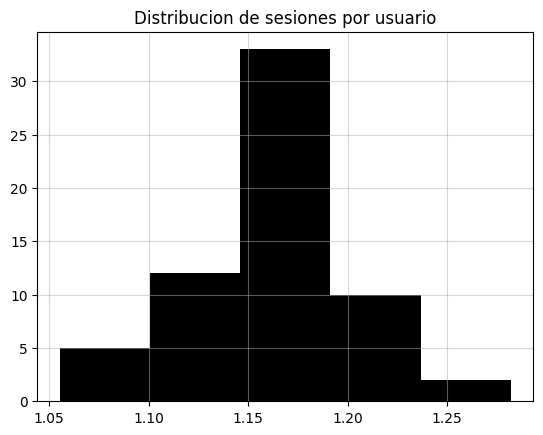
- Se encuentra que un usuario en promedio dura 664 segundos en la pagina .
- En promedio cada usuario vuelve 1 vez a la semana.

### 📈 Tasa de Conversión 

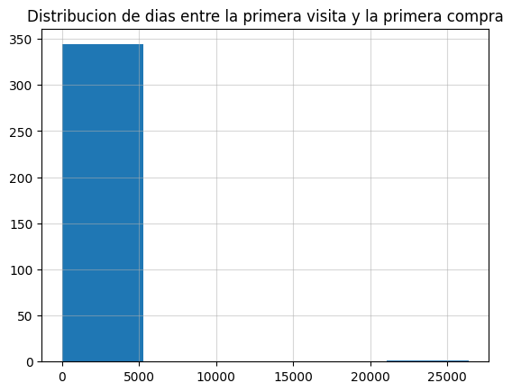
- Durante el primer dia el 72.18% de los clientes toman la decision de comprar.

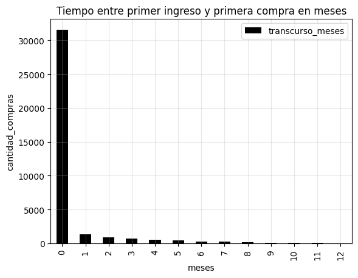
- Ratifica que la mayoria de los clientes compran en el primer mes.

### 💰Comportamiento compras
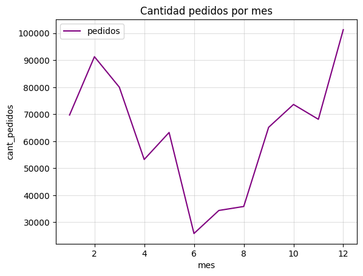
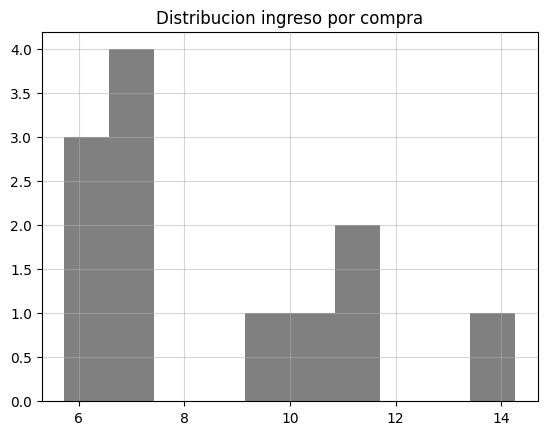
- En promedio por cada compra se ingresan 8.62$ Dolares.
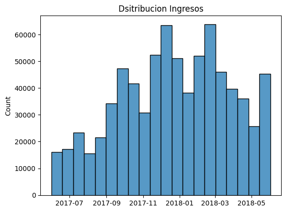
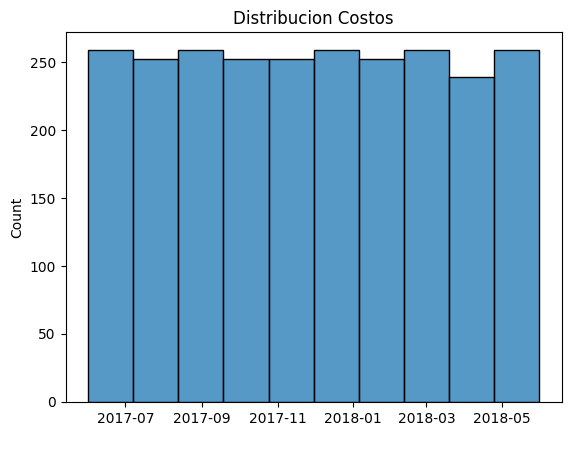

### 🧭 LTV 

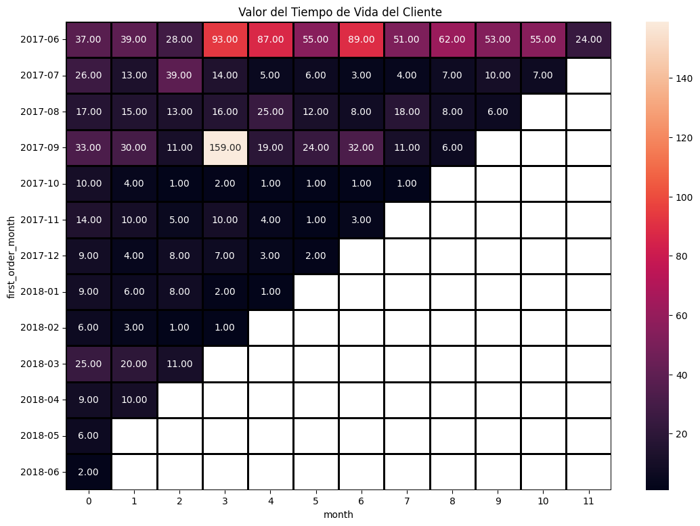
- En promedio un cliente nos reporta ingresos de 18.2$

### 📊 Comparación de Costos Marketing 
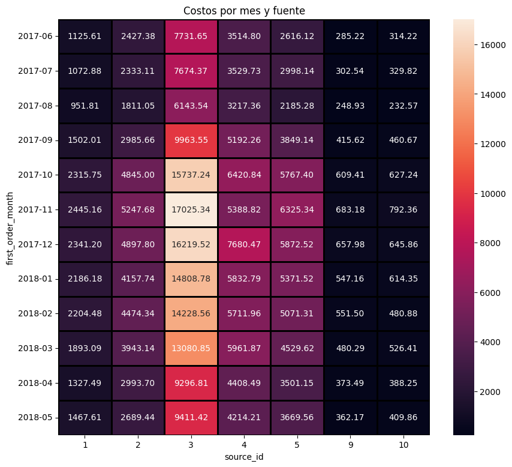
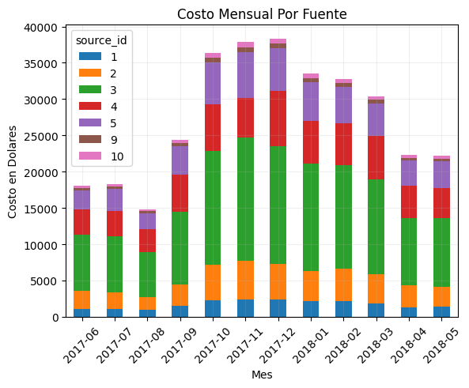

### 💸 CAC por Fuente  
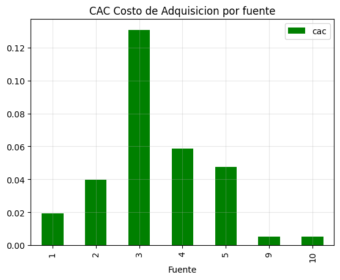

### 📉 ROMI 
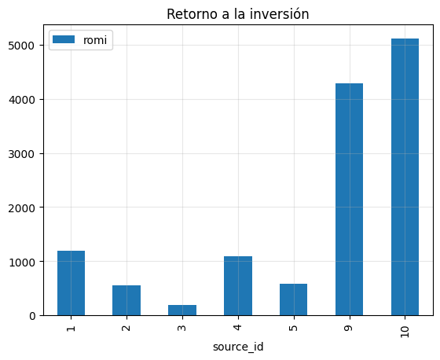

---

## 🧰 Herramientas Utilizadas

- **Python**: manipulación y análisis de datos  
- **Pandas**: limpieza y transformación  
- **Matplotlib & Seaborn**: visualización de datos  
- **NumPy & SciPy**: estadísticas y prueba de hipótesis  
- **Jupyter Notebook**

---

## 🚀 Conclusion

El informe muestra resultados positivos generales, con un LTV mayor que el CAC, indicando ganancias por encima del margen del 50%. Sin embargo, las fuentes de marketing con mayor uso generan menor retorno, siendo la fuente 3 la de mayor costo y menor retorno, mientras que la fuente 10 tiene el menor costo y mayor retorno.

Se destaca la necesidad de volumen de clientes, ya que la alta tasa de conversión del primer día (72.18%) sugiere que la prioridad debe ser atraer usuarios a la página. El tiempo promedio de visita (10 minutos) y la frecuencia semanal indican una decisión de compra rápida una vez que el cliente ingresa.

Mensualmente, las ventas disminuyeron en noviembre de 2017 (mes 6), a pesar de ser el segundo mes con mayor inversión en publicidad, lo que requiere investigación (posiblemente relacionado con la falta de eventos relevantes). El ingreso promedio por venta es de $8.62, y el valor de vida promedio del cliente es de $18.92, lo que implica que realizan más de una compra. Se enfatiza la importancia del volumen de clientes y el alcance.

